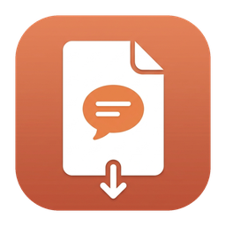

<div align="center">
  
  <h1>CCExport</h1>
  <p>Export a Claude Code session to a single, self-contained HTML file.</p>
</div>

CCExport is a native macOS app that browses your local Claude Code sessions and
exports any one of them to **one self-contained HTML file** — then opens it in
your browser. The file has zero external assets, so you can keep it, share it, or
open it anywhere.

## Features

- **Browse** every session under `~/.claude/projects`, newest first, with the
  project name on each row and instant search.
- **Live preview** of the selected session (first 500 lines) right in the app.
- **One-file export**: inline CSS and icons, no network, GitHub-Markdown styling.
- **Tool calls fold away**: each tool call and its result sit in a native
  `<details>` block, so long output stays out of the way (no JavaScript needed).
- **Reads the transcript faithfully**: separates real "You" turns from
  system-injected content — skill bodies, context-compaction summaries,
  background-task notifications, and interrupt markers all render as quiet notes.
- **Companion CLI** sharing the same renderer, for scripting.

## Install / build

The app is a standard Xcode project generated from `project.yml` with
[XcodeGen](https://github.com/yonaskolb/XcodeGen) (`brew install xcodegen`):

```bash
./scripts/build.sh            # xcodegen generate → xcodebuild
open build/Build/Products/Debug/CCExport.app
```

Or grab the prebuilt `CCExport.app` from the
[latest release](https://github.com/Saqoosha/CCExport/releases).

Pick a session in the sidebar and hit **Export & Open** (⌘↵). The HTML lands in
`~/Desktop/CCExport/` and opens in your default browser. The first export may ask
for permission to write to your Desktop — normal for a locally-signed app.

## CLI

```bash
swift run ccexport list                      # list all sessions
swift run ccexport export <id|path.jsonl>    # export + open
swift run ccexport export <id> --no-open     # write only
swift run ccexport export <id> --stdout      # HTML to stdout
swift run ccexport export <id> -o out.html   # custom path
```

`<id>` accepts a full session UUID or an 8-character prefix.

## How it works

Claude Code stores each session as a JSONL file under
`~/.claude/projects/<encoded-cwd>/<uuid>.jsonl`. CCExport:

1. **Scans** that directory, reading just enough of each file for a title + path.
2. **Parses** the selected session's JSONL into typed content blocks
   (text, tool_use, tool_result, thinking, image).
3. **Renders** Markdown (via [apple/swift-markdown](https://github.com/apple/swift-markdown),
   GFM) and assembles a self-contained HTML document with inlined CSS and icons.

See [docs/DESIGN.md](docs/DESIGN.md) for the full design.

## Layout

```
project.yml         XcodeGen spec → CCExport.xcodeproj (the macOS app)
Package.swift       SwiftPM: CCExportCore library + ccexport CLI
Sources/
  CCExportCore/     parser · scanner · markdown→HTML · renderer · exporter
  CCExportApp/      SwiftUI app (session list + live preview + export)
  ccexport/         CLI
scripts/
  build.sh          xcodegen generate + xcodebuild → CCExport.app
  make_iconset.py   regenerate the app icon from images/icon-source.png
```

The Xcode app target depends on `CCExportCore` as a local Swift package, so the
parser/renderer is shared between the app and the CLI.

## Notes

- Sub-agent (Task) calls show the prompt and final result; their intermediate
  steps aren't reconstructed (current Claude Code versions don't store them in a
  recoverable form).
- `thinking` blocks are omitted by design (conversation + tools profile).
- Very large tool inputs/results are truncated in the export to keep file size sane.

## License

[MIT](LICENSE) © Saqoosha
